# StackTask — Complete Application Design Specification

> A native Apple task manager that makes planning feel effortless.

---

## Table of Contents

1. [Product Requirements Document](#1-product-requirements-document)
2. [User Flows](#2-user-flows)
3. [UX Review](#3-ux-review)
4. [Wireframes](#4-wireframes)
5. [Technical Architecture](#5-technical-architecture)
6. [Animation Specification](#6-animation-specification)
7. [Design System](#7-design-system)
8. [Feature Roadmap](#8-feature-roadmap)
9. [Risk Assessment](#9-risk-assessment)
10. [Implementation Plan](#10-implementation-plan)

---

# 1. Product Requirements Document

## 1.1 Product Vision

**StackTask** is a timeline-based task manager for Apple platforms that makes planning life feel calm, fast, and enjoyable. Time flows through the app — tasks stack up naturally, rolling forward if unfinished, never lost, never punishing. The name reflects the core metaphor: tasks stack on top of each other, with overdue items always rising to the top of the stack.

## 1.2 Target Platforms (v1.0)

| Platform | Priority | Status |
|----------|----------|--------|
| macOS | Primary | v1.0 |
| iPhone | Primary | v1.0 |
| iPad | Secondary | v1.5 |
| Apple Watch | Secondary | v2.0 |

## 1.3 Core Concept — The Moving Timeline

The entire UI is organized around a **horizontal timeline** that scrolls across multiple days. A vertical "now" line continuously advances in real-time, giving the user a visceral sense of time passing. Tasks are cards placed on this timeline.

**From your mockup, the key layout hierarchy is:**

```
┌─────────────────────────────────────────────────────────────┐
│  Day Headers:  Friday, June 19  │  Saturday, June 20  │ ...│
│  ─────────────────────────────────────────────────────────  │
│                        │ NOW LINE (red/coral)               │
│  [Overdue Tasks]       │ [Today Tasks]        [Tomorrow]    │
│    coral cards         │   blue cards           blue cards   │
│    "2 days overdue"    │   timed + anytime                  │
│                        │                                    │
│                                                             │
│  ┌─────────────────────────────────────────────────────┐    │
│  │  "What Needs Doing..."   Today  Tmrw  Custom  •••  │    │
│  └─────────────────────────────────────────────────────┘    │
└─────────────────────────────────────────────────────────────┘
```

### Now Line Behavior (Critical)

The red now-line moves **continuously** throughout the day in correspondence with the live time.

**Rules:**
- The now-line is allowed to move **over** today's tasks. Today's incomplete tasks may appear to the **left** of the now-line — this is the ONLY case where tasks appear behind it.
- Tasks from **other days** (overdue, future) can NEVER appear behind the now-line.
- At **midnight (12:00 AM)**: any incomplete tasks from the ending day instantly reset to overdue positions at the top of the stack for the new day.
- Overdue tasks are ALWAYS stacked **on top** of the current day's tasks, ahead of the now-line.

### Slot-Machine Scroll Effect

When a day column has many tasks, the list scrolls vertically with a **slot-machine fade effect**: tasks at the bottom edge of the visible area gradually fade out, creating a smooth, non-overwhelming scroll experience. This is purely a visual mask — all tasks are still accessible by scrolling.

## 1.4 Task Model

### Task Types

| Type | Description | Behavior |
|------|-------------|----------|
| **Anytime** | Default. No specific time. | Appears in day's "Anytime" section. Most tasks are this. |
| **Timed** | Has start time and optionally end time. | Positioned at its time on the timeline. Acts like a calendar event. |
| **Recurring** | Repeats on a schedule. | Completing one creates the next occurrence automatically. |

### Task Properties

| Property | Required | Default | Notes |
|----------|----------|---------|-------|
| `title` | ✅ | — | The only required field |
| `scheduledDate` | ✅ | Today | Auto-set to today for brain-dump flow |
| `startTime` | ❌ | nil | Only if user specifies |
| `endTime` | ❌ | nil | Only if user specifies |
| `isCompleted` | ✅ | false | — |
| `completedAt` | ❌ | nil | Set on completion |
| `originalDate` | ✅ | Same as scheduledDate | For overdue tracking |
| `overdueCount` | Computed | 0 | Days between originalDate and today |
| `recurrenceRule` | ❌ | nil | For recurring tasks |
| `notes` | ❌ | nil | Optional detail |
| `reminder` | ❌ | nil | Notification time |
| `priority` | ❌ | `.none` | Low / Medium / High / None |
| `tags` | ❌ | [] | Lightweight categorization |
| `naturalLanguageRaw` | ❌ | nil | Original NLP input for AI training |
| `createdAt` | ✅ | now | — |
| `updatedAt` | ✅ | now | — |

### Overdue Behavior (Defining Feature)

```
Every day at midnight (or on app launch):
  For each incomplete task where scheduledDate < today:
    → Move scheduledDate to today
    → Increment visual overdue counter (today - originalDate)
    → Preserve originalDate for "X days overdue" label
    → Stack overdue tasks at the VERY TOP, before ALL of today's tasks
    → Apply coral color treatment
    → Similar overdue tasks may be collapsed (by overdue duration or type)
```

**Stacking Order (top to bottom):**
1. Overdue tasks (coral) — oldest first, collapsible by group
2. Today's timed tasks (blue) — sorted by start time
3. Today's anytime tasks (blue)
4. Completed section (collapsible)

**Overdue Collapsing:** When there are many overdue tasks, similar ones (e.g., tasks overdue by the same number of days) can be collapsed into a summary bar ("3 tasks · 2 days overdue") to save space. Users can expand to see individual tasks.

> [!IMPORTANT]
> Tasks never disappear. They never stay trapped on a past day. They always roll forward. This is non-negotiable.

### Completed Tasks

- Move into a collapsible "Completed" section at the bottom of each day
- Show a subtle strikethrough + fade treatment
- Accessible but not cluttering the active view
- An **Undo toast** appears for 5 seconds after completion

### Deletion

- Requires confirmation (swipe + confirm, or context menu)
- An **Undo toast** appears for 5 seconds after deletion
- Soft animation on removal (dissolve + collapse)

## 1.5 Timeline Views

| View | Content | Best For |
|------|---------|----------|
| **3-Day** (Default) | Today + Next 2 Days (with overdue rolled into today) | Daily planning |
| **Week** | 7 days starting from today | Weekly overview |
| **Month** | Calendar grid with task dots / counts | Long-range planning |

> [!NOTE]
> **Confirmed: Today + Next 2 Days** (forward-looking). Yesterday's tasks have already rolled into today's overdue section — showing yesterday as a separate column is redundant. Looking forward is more actionable.

## 1.6 Task Creation

### Desktop (macOS)

| Method | Interaction | Speed |
|--------|-------------|-------|
| **Quick Add Bar** | Always visible at bottom. Click or `⌘N`. Type title. Enter to save. | < 2 sec |
| **Command Palette** | `⌘K` → type task → Enter | < 3 sec |
| **Keyboard Shortcut** | `⌘N` focuses the quick add bar | < 2 sec |

### Mobile (iPhone)

| Method | Interaction | Speed |
|--------|-------------|-------|
| **Bottom Input** | Persistent floating input at bottom. Tap. Type. Done. | < 3 sec |
| **Quick Date Chips** | "Today" / "Tmrw" / "Custom" chips next to input (from your mockup) | 1 extra tap |

### Quick Add Bar Behavior

```
┌───────────────────────────────────────────────────────────┐
│  "What Needs Doing..."   [Today] [Tmrw] [Custom Date] •••│
└───────────────────────────────────────────────────────────┘
```

- Default behavior: **Task creation** — always. No guessing.
- `/` prefix → Command mode (like Slack)
- `?` prefix → AI query mode
- Default destination: **Today, Anytime**
- Date chips change the target day
- Three-dot menu opens: time picker, recurrence, priority, tags
- **Enter** saves immediately
- **Escape** clears and defocuses
- The popover from your mockup (showing "Anytime" / "From: / To:") appears from the ••• menu

## 1.7 Task Editing

### Desktop

| Action | Trigger |
|--------|---------|
| **Inline Title Edit** | Double-click task card |
| **Quick Edit Popover** | Single click → popover with all fields |
| **Context Menu** | Right-click → Edit / Delete / Move / Duplicate / Complete |
| **Drag to Reschedule** | Drag task card to another day column |

### Mobile

| Action | Trigger |
|--------|---------|
| **Inline Title Edit** | Tap task → inline edit mode |
| **Detail Sheet** | Tap edit icon or long-press → half-sheet with fields |
| **Context Menu** | Long press → iOS context menu |
| **Swipe Actions** | Left swipe → Complete. Right swipe → Reschedule. |

## 1.8 Command Palette (macOS)

Triggered by `⌘K`. Raycast-style overlay.

```
┌────────────────────────────────────────┐
│  🔍  Type a command or task...         │
│  ─────────────────────────────────────│
│  📝 New Task                    ⌘N    │
│  🔍 Search Tasks                ⌘F    │
│  📅 Go to Today                ⌘T    │
│  📅 Go to Week View             ⌘2    │
│  📅 Go to Month View            ⌘3    │
│  🤖 Ask AI                     ⌘I    │
│  ⚙️ Settings                   ⌘,    │
│  ─────────────────────────────────────│
│  Recent Tasks                          │
│  • Buy groceries                       │
│  • Call Mom                            │
└────────────────────────────────────────┘
```

Capabilities:
- Create tasks by typing directly (if input doesn't match a command)
- Navigate views
- Search tasks
- Issue AI commands ("What's overdue?", "Move everything to Friday")
- Access settings
- Fuzzy matching on commands and task titles

## 1.9 Notifications

| Type | Trigger | Default |
|------|---------|---------|
| **Task Reminder** | User-set time before a timed task | 15 min before |
| **Morning Summary** | Configurable morning time | 8:00 AM, daily |
| **Evening Review** | Configurable evening time | 8:00 PM, daily |
| **Overdue Reminder** | Tasks overdue > 1 day | 9:00 AM, once |
| **Recurring Reminder** | When a recurring task becomes due | On scheduled date |

## 1.10 Recurring Tasks

| Pattern | Example |
|---------|---------|
| Daily | "Take vitamins every day" |
| Weekly | "Gym every Monday" |
| Monthly | "Pay rent on the 1st" |
| Custom | "Every 3 days", "Every 2 weeks on Tue/Thu" |

**Behavior:** Completing a recurring task:
1. Marks current instance as complete (moves to Completed section)
2. Automatically creates next occurrence based on recurrence rule
3. Next occurrence appears on the timeline at the appropriate date
4. Smooth animation: completed card slides away, new card materializes on future date

## 1.11 Search

- **Activation:** `⌘F` on macOS, pull-down or search icon on iOS
- **Scope:** Titles, notes, dates, tags
- **Speed:** Instant local search (< 100ms)
- **Future:** AI semantic search ("tasks about health", "things I keep postponing")

## 1.12 AI Integration

### Architecture: Provider-Agnostic Abstraction

```swift
protocol AIProvider {
    func complete(prompt: String, context: AIContext) async throws -> AIResponse
    func stream(prompt: String, context: AIContext) -> AsyncThrowingStream<String, Error>
}

// Implementations:
struct OpenAIProvider: AIProvider { ... }
struct ClaudeProvider: AIProvider { ... }
struct GeminiProvider: AIProvider { ... }
struct LocalModelProvider: AIProvider { ... }
```

### v1.0 AI Capabilities

| Capability | Example |
|------------|---------|
| **Natural Language Task Creation** | "Call Mom tomorrow at 3" → Task(title: "Call Mom", date: tomorrow, startTime: 3pm) |
| **Task Queries** | "What's overdue?" → filtered list |
| **Bulk Operations** | "Move everything to Friday" → batch reschedule |

### NLP Parsing Fallback

When the parser isn't confident (< 70% confidence threshold):

```
User types: "thing friday maybe"
┌──────────────────────────────────────────────┐
│  I wasn't sure about this one:               │
│                                              │
│  Title: "thing"         [Edit]               │
│  Date:  Friday, Jul 4   [Change]             │
│                                              │
│  [Looks Good]        [Let Me Fix It]         │
└──────────────────────────────────────────────┘
```

Lightweight inline clarification — not a modal, not a blocker. A gentle nudge.

### Future AI Capabilities (v2.0+)

- Scheduling suggestions ("You have a free hour at 2pm — want to fit in 'Call Mom'?")
- Workload summarization ("You've completed 12 tasks this week, 3 are overdue")
- Task decomposition ("Break 'Plan vacation' into subtasks")
- Smart reminders based on behavior patterns

## 1.13 Settings

| Section | Options |
|---------|---------|
| **Appearance** | Light / Dark / System theme |
| **Notifications** | Morning summary, evening review, overdue reminders, reminder defaults |
| **Default View** | 3-Day / Week / Month |
| **Task Defaults** | Default date (Today), default reminder offset |
| **Recurring Tasks** | Management of recurring patterns |
| **AI Provider** | Select provider, API key, enable/disable NLP |
| **Keyboard Shortcuts** | View and customize |
| **Calendar Integration** | Connect Apple Calendar (future) |
| **Sync** | iCloud sync toggle (future) |
| **Privacy** | Data handling, analytics opt-out |
| **Widgets** | Widget configuration |
| **Experimental** | Feature flags for beta features |
| **About** | Version, credits, feedback |

## 1.14 Offline Behavior

- **All data is local-first.** The app works fully offline.
- When cloud sync is added (future), changes queue locally and sync when connectivity returns.
- No loading spinners for local operations. Ever.

## 1.15 Undo System

After any destructive action (delete, complete):

```
┌───────────────────────────────────────┐
│  ✓ Task completed     [Undo]    5s   │
└───────────────────────────────────────┘
```

- Toast appears at bottom of screen
- 5-second window to undo
- Smooth slide-in / slide-out animation
- Stacks if multiple actions occur rapidly

---

# 2. User Flows

## 2.1 Task Creation Flow

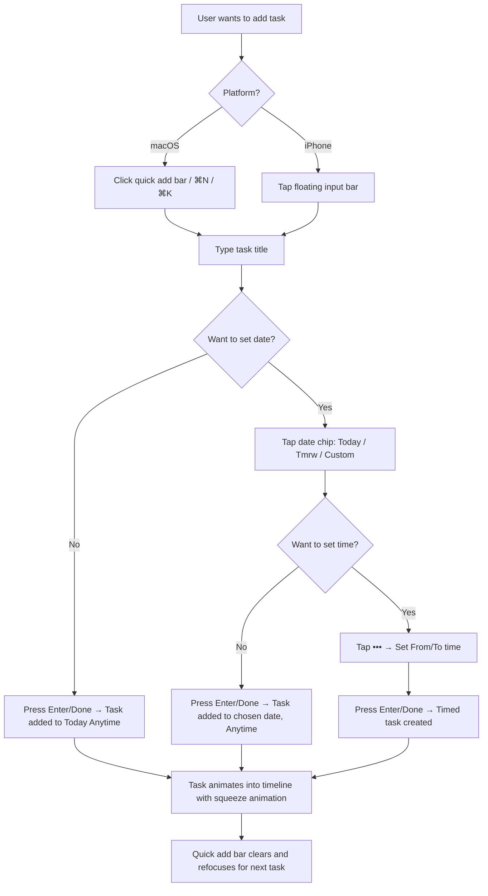

## 2.2 Task Completion Flow

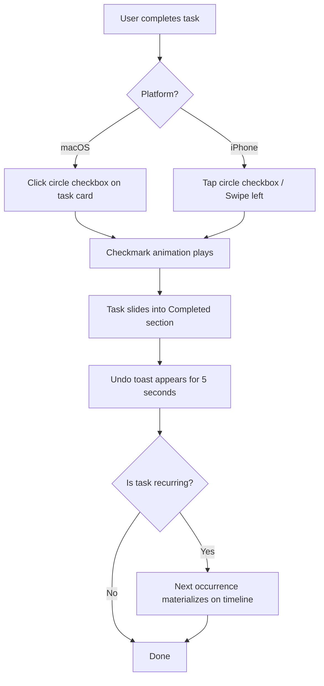

## 2.3 Task Editing Flow

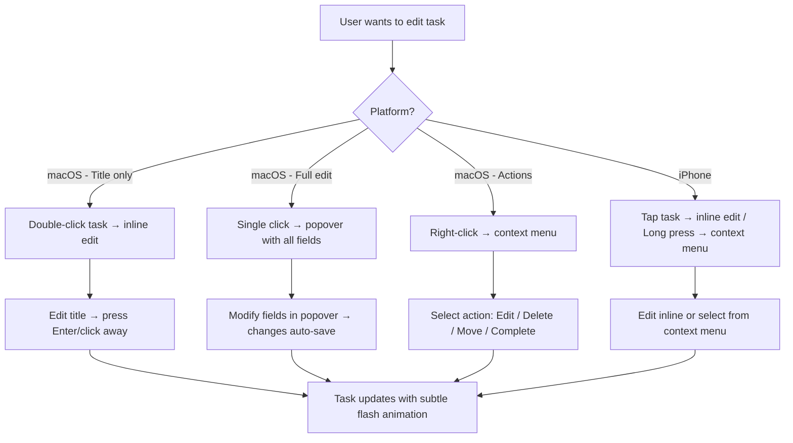

## 2.4 Task Deletion Flow

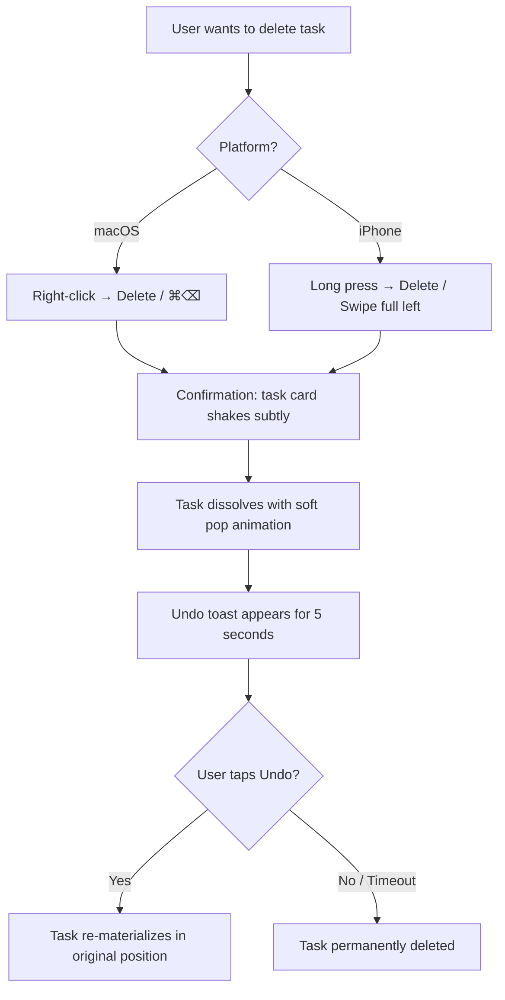

## 2.5 Overdue Rollover Flow

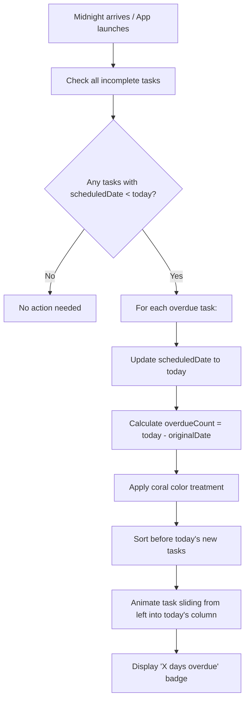

## 2.6 Recurring Task Flow

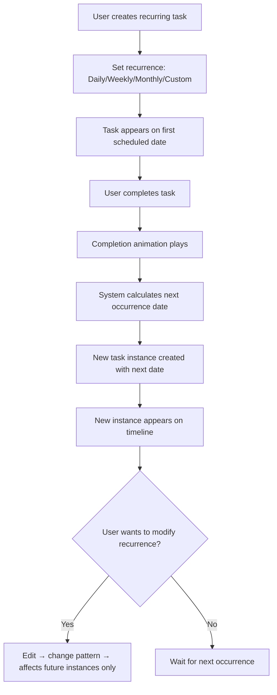

## 2.7 AI Interaction Flow

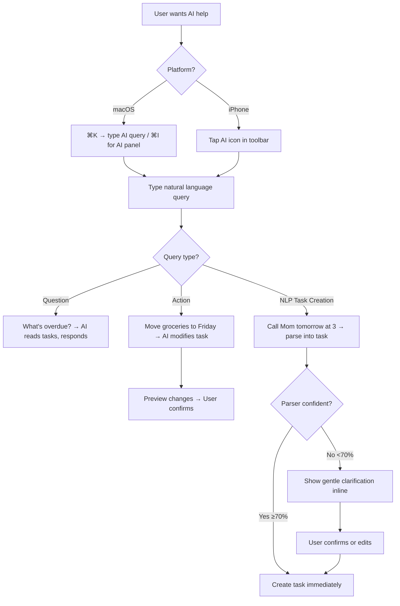

## 2.8 View Switching Flow

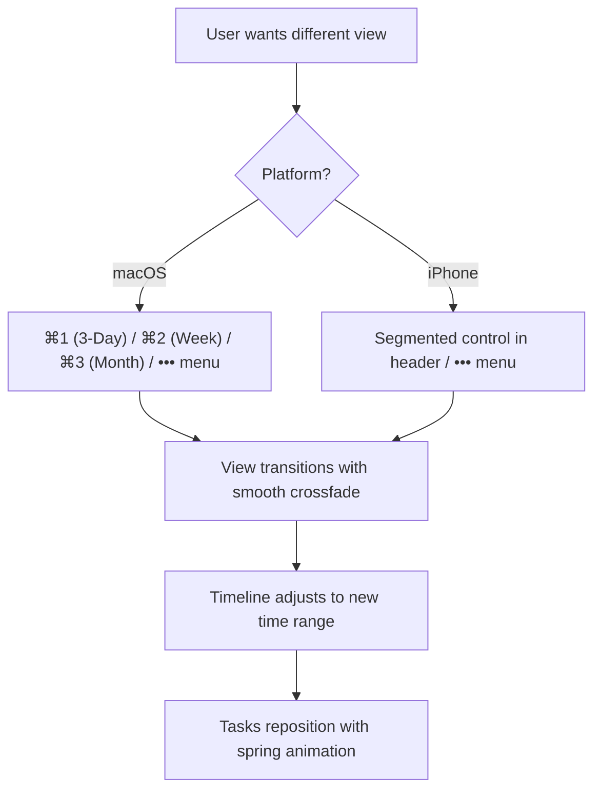

## 2.9 Search Flow

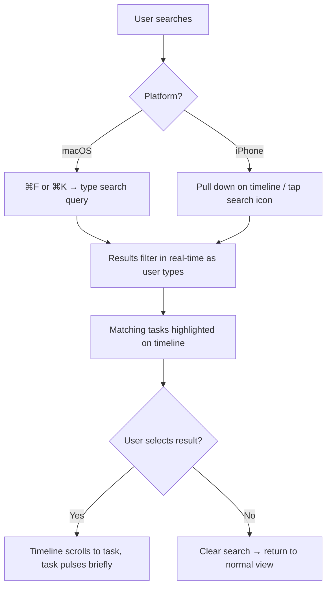

## 2.10 Notification Interaction Flow

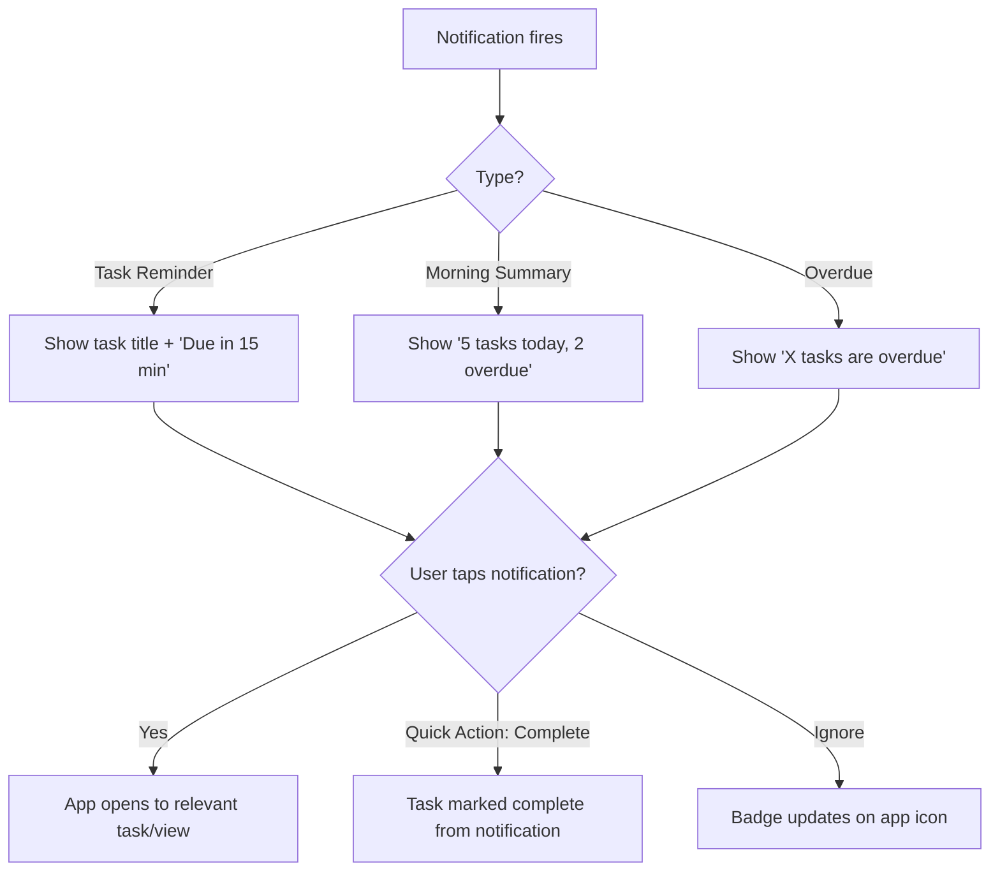

---

# 3. UX Review

## 3.1 Friction Points Identified & Solutions

### Friction Point 1: Timeline Overwhelm on Busy Days

**Problem:** If a user has 15+ tasks, the horizontal timeline could feel cramped and hard to scan.

**Solution:**
- Limit visible Anytime tasks to 5 per day section, with a "+X more" expandable
- Timed tasks always show (they have a fixed position)
- Overdue tasks are collapsible as a group ("3 overdue" summary bar)
- Smooth scroll within each day section

### Friction Point 2: Horizontal Scrolling on Mobile

**Problem:** Horizontal timelines conflict with iOS's vertical scroll paradigm. Horizontal swipe competes with back-gesture.

**Solution:**
- **iPhone uses a modified vertical layout:** Days stack vertically. Each day is a card. Swipe between days with page-style navigation.
- The "now" line becomes a horizontal divider separating "done" from "remaining" within today's view.
- The 3-day view shows Today as primary with peek previews of adjacent days.
- This preserves the timeline *concept* while respecting mobile interaction patterns.

> [!WARNING]
> **Do NOT directly port the horizontal timeline to iPhone.** The mockup layout works beautifully for macOS's wide screen and mouse/trackpad interaction. On iPhone, it would create tiny touch targets, awkward horizontal scrolling, and conflict with system gestures.

### Friction Point 3: "What Needs Doing..." Input Ambiguity

**Problem:** Is the bottom bar for creating tasks? Searching? AI commands? It needs to be clearly one thing by default.

**Solution:**
- Default behavior: **Task creation** (from your mockup, this is correct)
- Prefix with `/` for commands (like Slack)
- Prefix with `?` for AI queries
- Or just type naturally — if it looks like a question, route to AI; otherwise, create a task
- Keep it simple: 90% of the time, users are creating tasks

### Friction Point 4: Month View Complexity

**Problem:** Month views in task apps often become overwhelming miniature calendars.

**Solution:**
- Month view shows a calendar grid with **dot indicators** (1-3 dots = task density)
- Tapping a day expands it into a day detail view (similar to Apple Calendar)
- Not trying to show all tasks in the month grid — that's information overload
- Month view is for *planning* and *seeing patterns*, not for *working*

**Dot Color System:**
| Dot Color | Meaning |
|-----------|--------|
| **Blue** | Active/upcoming tasks |
| **Coral** | Overdue tasks (on present day) |
| **Grey** | Past tasks that were completed on time |
| **Faded Coral** | Past tasks that were eventually completed but were overdue |

### Friction Point 5: Overdue Anxiety

**Problem:** A growing pile of overdue tasks can create shame and avoidance.

**Solution:**
- Warm coral color — not aggressive red. Coral says "hey, let's handle this" not "YOU FAILED"
- Overdue section is collapsible — user can acknowledge but choose to focus on today
- After 7+ days overdue, offer a gentle "Still relevant?" prompt to help clean up
- The language is never judgmental: "from 2 days ago" instead of "2 DAYS OVERDUE!!"

### Friction Point 6: Recurring Task Editing Ambiguity

**Problem:** When editing a recurring task, does the change apply to just this instance or all future instances?

**Solution:**
- On edit, show a lightweight prompt: "Just this one" / "This and future"
- On delete, same pattern: "Just this one" / "All future"
- Default to "Just this one" for safety

## 3.2 Removed Complexity

| Proposed Feature | Decision | Reasoning |
|-----------------|----------|-----------|
| Subtasks | **Deferred to v1.5** | Adds significant complexity to data model, UI, and interactions. v1.0 keeps tasks flat. |
| Projects/Folders | **Deferred to v2.0** | Tags provide lightweight grouping without folder hierarchy overhead |
| Kanban board view | **Not planned** | Conflicts with timeline-first philosophy |
| Time tracking | **Not planned** | Different product category; adds friction |
| File attachments | **Deferred to v2.0** | Significant storage/sync complexity |
| Collaboration | **Deferred to vSaaS** | Requires server infrastructure |

---

# 4. Wireframes

## 4.1 macOS — 3-Day View (Primary)

```
┌──────────────────────────────────────────────────────────────────────────┐
│  ◀  StackTask                 ⌘K Search & Commands          ⚙️  👤        │
├──────────────────────────────────────────────────────────────────────────┤
│  [3 Day ▼]    ◀ Jun 28   Jun 29   Jun 30 ▶         [Today]            │
├──────────────────────────────────────────────────────────────────────────┤
│                                                                          │
│   Saturday, Jun 28         │ Sunday, Jun 29            Monday, Jun 30    │
│   ─────────────────        │ ─────────────────        ─────────────────  │
│                            │                                             │
│   ⚠ OVERDUE               │NOW│                                         │
│   ┌────────────────┐       │   │                                         │
│   │ ○ Get groceries│       │   │  Anytime                                │
│   │  2 days ago    │coral  │   │  ┌─────────────────────┐                │
│   └────────────────┘       │   │  │ ○ Do Homework       │ blue           │
│   ┌────────────────────┐   │   │  └─────────────────────┘                │
│   │ ○ Meetup w/ Friend │   │   │                         Anytime         │
│   │  1 day ago         │   │   │                         ┌──────────────┐│
│   └────────────────────┘   │   │                         │ ○ Work on    ││
│                            │   │  10:00 AM               │   Resume     ││
│   Today                   │   │  ┌─────────────────────┐ └──────────────┘│
│   ┌────────────────────────┐   │  │ ○ Meeting w/ Friend │                │
│   │ Nothing more today ✨  │   │  │  10am - 10pm        │ blue           │
│   └────────────────────────┘   │  └─────────────────────┘                │
│                            │   │                                         │
│   ▼ Completed (2)          │   │                                         │
│                            │   │                                         │
│                                                                          │
├──────────────────────────────────────────────────────────────────────────┤
│  💭 What Needs Doing...           [Today] [Tmrw] [📅 Date] [•••]       │
└──────────────────────────────────────────────────────────────────────────┘
```

## 4.2 macOS — Week View

```
┌──────────────────────────────────────────────────────────────────────────┐
│  ◀  StackTask                 ⌘K Search & Commands          ⚙️  👤        │
├──────────────────────────────────────────────────────────────────────────┤
│  [Week ▼]    ◀ Jun 29 - Jul 5 ▶                         [Today]        │
├──────────────────────────────────────────────────────────────────────────┤
│                                                                          │
│  Sun 29│ Mon 30│ Tue 1 │ Wed 2 │ Thu 3 │ Fri 4 │ Sat 5                 │
│  ──────│───────│───────│───────│───────│───────│──────                  │
│  │NOW│ │       │       │       │       │       │                        │
│  ⚠ 2   │ 3     │ 1     │       │ 2     │ 1     │                        │
│  tasks  │ tasks │ task  │  ──   │ tasks │ task  │  ──                    │
│  ┌──┐   │ ┌──┐  │ ┌──┐  │       │ ┌──┐  │ ┌──┐  │                        │
│  │••│   │ │••│  │ │••│  │       │ │••│  │ │••│  │                        │
│  └──┘   │ └──┘  │ └──┘  │       │ └──┘  │ └──┘  │                        │
│  ┌──┐   │ ┌──┐  │       │       │ ┌──┐  │       │                        │
│  │••│   │ │••│  │       │       │ │••│  │       │                        │
│  └──┘   │ └──┘  │       │       │ └──┘  │       │                        │
│         │ ┌──┐  │       │       │       │       │                        │
│         │ │••│  │       │       │       │       │                        │
│         │ └──┘  │       │       │       │       │                        │
│                                                                          │
├──────────────────────────────────────────────────────────────────────────┤
│  💭 What Needs Doing...           [Today] [Tmrw] [📅 Date] [•••]       │
└──────────────────────────────────────────────────────────────────────────┘
```

## 4.3 macOS — Month View

```
┌──────────────────────────────────────────────────────────────────────────┐
│  ◀  StackTask                 ⌘K Search & Commands          ⚙️  👤        │
├──────────────────────────────────────────────────────────────────────────┤
│  [Month ▼]    ◀  July 2026  ▶                           [Today]        │
├──────────────────────────────────────────────────────────────────────────┤
│                                                                          │
│     Sun     Mon     Tue     Wed     Thu     Fri     Sat                  │
│  ┌───────┬───────┬───────┬───────┬───────┬───────┬───────┐              │
│  │       │       │   1   │   2   │   3   │   4   │   5   │              │
│  │       │       │  •    │       │  ••   │  •    │       │              │
│  ├───────┼───────┼───────┼───────┼───────┼───────┼───────┤              │
│  │   6   │   7   │   8   │   9   │  10   │  11   │  12   │              │
│  │  •••  │  ••   │       │  •    │       │  ••   │       │              │
│  ├───────┼───────┼───────┼───────┼───────┼───────┼───────┤              │
│  │  13   │  14   │  15   │  16   │  17   │  18   │  19   │              │
│  │       │  •    │  •    │       │  •••  │       │       │              │
│  ├───────┼───────┼───────┼───────┼───────┼───────┼───────┤              │
│  │  20   │  21   │  22   │  23   │  24   │  25   │  26   │              │
│  │  ••   │       │       │  •    │       │  •    │  ••   │              │
│  ├───────┼───────┼───────┼───────┼───────┼───────┼───────┤              │
│  │  27   │  28   │  29   │  30   │  31   │       │       │              │
│  │       │  •    │ [•••] │       │  ••   │       │       │              │
│  └───────┴───────┴───────┴───────┴───────┴───────┴───────┘              │
│                           ↑ Today highlighted                           │
│                                                                          │
│  Tapping a day opens day detail overlay                                  │
│                                                                          │
├──────────────────────────────────────────────────────────────────────────┤
│  💭 What Needs Doing...           [Today] [Tmrw] [📅 Date] [•••]       │
└──────────────────────────────────────────────────────────────────────────┘
```

## 4.4 macOS — Command Palette (⌘K)

```
            ┌────────────────────────────────────────────┐
            │  🔍  Type a command or task...             │
            │  ─────────────────────────────────────────│
            │  ⚡ COMMANDS                               │
            │  ┌────────────────────────────────────┐    │
            │  │ 📝 New Task                  ⌘N   │    │
            │  │ 🔍 Search                    ⌘F   │    │
            │  │ 📅 Today                     ⌘T   │    │
            │  │ 📅 3-Day View                ⌘1   │    │
            │  │ 📅 Week View                 ⌘2   │    │
            │  │ 📅 Month View                ⌘3   │    │
            │  │ 🤖 Ask AI                    ⌘I   │    │
            │  │ ⚙️ Settings                  ⌘,   │    │
            │  └────────────────────────────────────┘    │
            │                                            │
            │  🕐 RECENT                                 │
            │  ┌────────────────────────────────────┐    │
            │  │ ○ Buy groceries        2 days ago  │    │
            │  │ ○ Call Mom              Today       │    │
            │  │ ✓ Finish report         Yesterday  │    │
            │  └────────────────────────────────────┘    │
            └────────────────────────────────────────────┘
```

## 4.5 macOS — Task Edit Popover

```
                    ┌──────────────────────────────┐
                    │  Buy Groceries          [×]  │
                    │  ─────────────────────────── │
                    │                              │
                    │  📅 Date:  Today       [📅]  │
                    │  🕐 Time:  Anytime     [🕐]  │
                    │  🔄 Repeat: None       [🔄]  │
                    │  🔔 Remind: None       [🔔]  │
                    │  🏷️ Tags:  +Add        [🏷️]  │
                    │  📝 Notes:                   │
                    │  ┌──────────────────────┐    │
                    │  │ Get milk, eggs,      │    │
                    │  │ bread, avocados      │    │
                    │  └──────────────────────┘    │
                    │                              │
                    │  [🗑️ Delete]    [✓ Complete] │
                    └──────────────────────────────┘
```

## 4.6 iPhone — 3-Day View (Primary)

```
┌─────────────────────────────┐
│ ☰  StackTask          🔍  •••  │
│  [3 Day] [Week] [Month]    │
├─────────────────────────────┤
│                             │
│  ◀  Today, Jun 29  ▶       │
│  ─────────────────────────  │
│                             │
│  ⚠ OVERDUE                 │
│  ┌───────────────────────┐  │
│  │ ○ Get groceries       │  │
│  │   2 days ago          │  │
│  └───────────────────────┘  │
│  ┌───────────────────────┐  │
│  │ ○ Meetup with Friend  │  │
│  │   1 day ago           │  │
│  └───────────────────────┘  │
│                             │
│  🕐 TIMED                  │
│  ┌───────────────────────┐  │
│  │ ○ Meeting w/ Friend   │  │
│  │   10:00 AM - 10:00 PM │  │
│  └───────────────────────┘  │
│                             │
│  ☀️ ANYTIME                 │
│  ┌───────────────────────┐  │
│  │ ○ Do Homework         │  │
│  └───────────────────────┘  │
│                             │
│  ▼ Completed (2)           │
│                             │
│  ─── Peek: Tomorrow ───    │
│  ┌───────────────────────┐  │
│  │ ○ Work on Resume      │  │
│  └───────────────────────┘  │
│                             │
├─────────────────────────────┤
│ 💭 What Needs Doing...     │
│      [Today][Tmrw][📅][•••]│
└─────────────────────────────┘
```

## 4.7 iPhone — Week View

```
┌─────────────────────────────┐
│ ☰  StackTask          🔍  •••  │
│  [3 Day] [Week] [Month]    │
├─────────────────────────────┤
│                             │
│  ◀  Jun 29 - Jul 5  ▶      │
│                             │
│  S   M   T   W   T   F   S │
│ [29] 30   1   2   3   4   5│
│  ●   ●●  ●       ●●  ●     │
│                             │
│  ── Sunday, Jun 29 ──       │
│                             │
│  ⚠ OVERDUE (2)             │
│  ┌───────────────────────┐  │
│  │ ○ Get groceries       │  │
│  │   2 days ago          │  │
│  └───────────────────────┘  │
│  ┌───────────────────────┐  │
│  │ ○ Meetup with Friend  │  │
│  │   1 day ago           │  │
│  └───────────────────────┘  │
│                             │
│  🕐 TIMED                  │
│  ┌───────────────────────┐  │
│  │ ○ Meeting w/ Friend   │  │
│  │   10:00 AM - 10:00 PM │  │
│  └───────────────────────┘  │
│                             │
│  ☀️ ANYTIME                 │
│  ┌───────────────────────┐  │
│  │ ○ Do Homework         │  │
│  └───────────────────────┘  │
│                             │
├─────────────────────────────┤
│ 💭 What Needs Doing...     │
│      [Today][Tmrw][📅][•••]│
└─────────────────────────────┘
```

## 4.8 iPhone — Settings

```
┌─────────────────────────────┐
│  ◀ Settings                 │
├─────────────────────────────┤
│                             │
│  APPEARANCE                 │
│  ┌───────────────────────┐  │
│  │ Theme          System │  │
│  │ Accent Color    Coral │  │
│  └───────────────────────┘  │
│                             │
│  DEFAULTS                   │
│  ┌───────────────────────┐  │
│  │ Default View   3-Day  │  │
│  │ New Task Date  Today  │  │
│  │ Reminder       None   │  │
│  └───────────────────────┘  │
│                             │
│  NOTIFICATIONS              │
│  ┌───────────────────────┐  │
│  │ Morning Summary    ✓  │  │
│  │ Evening Review     ✓  │  │
│  │ Overdue Reminders  ✓  │  │
│  └───────────────────────┘  │
│                             │
│  AI                         │
│  ┌───────────────────────┐  │
│  │ Provider      Claude  │  │
│  │ NLP Parsing       ✓   │  │
│  │ Smart Suggest     ✓   │  │
│  └───────────────────────┘  │
│                             │
│  DATA                       │
│  ┌───────────────────────┐  │
│  │ iCloud Sync    Coming │  │
│  │ Calendar       None   │  │
│  │ Export Data        ▶  │  │
│  └───────────────────────┘  │
│                             │
│  EXPERIMENTAL               │
│  ┌───────────────────────┐  │
│  │ AI Chat           ✓   │  │
│  │ Smart Schedule    ○   │  │
│  └───────────────────────┘  │
│                             │
│  ABOUT                      │
│  ┌───────────────────────┐  │
│  │ Version       1.0.0   │  │
│  │ Send Feedback     ▶   │  │
│  │ Privacy Policy    ▶   │  │
│  └───────────────────────┘  │
│                             │
└─────────────────────────────┘
```

## 4.9 macOS — AI Chat Panel

```
┌──────────────────────────────────────────────────────────────────────────┐
│  Main Timeline View                     │  AI Assistant                  │
│                                         │  ────────────────────────────  │
│  (3-Day timeline as shown above)        │                                │
│                                         │  🤖 Hi! I can help you with   │
│                                         │  your tasks. Try asking:       │
│                                         │                                │
│                                         │  "What's overdue?"             │
│                                         │  "What should I do first?"     │
│                                         │  "Move groceries to Friday"    │
│                                         │                                │
│                                         │  ────────────────────────────  │
│                                         │                                │
│                                         │  You: What's overdue?          │
│                                         │                                │
│                                         │  🤖 You have 2 overdue tasks:  │
│                                         │                                │
│                                         │  • Get groceries (2 days)      │
│                                         │  • Meetup w/ Friend (1 day)    │
│                                         │                                │
│                                         │  Want me to reschedule them?   │
│                                         │                                │
│                                         │  ────────────────────────────  │
│                                         │  💬 Ask about your tasks...    │
├─────────────────────────────────────────┴────────────────────────────────┤
│  💭 What Needs Doing...           [Today] [Tmrw] [📅 Date] [•••]       │
└──────────────────────────────────────────────────────────────────────────┘
```

## 4.10 Widget Wireframes

### Home Screen / Lock Screen Widget (Small)

```
┌─────────────────┐
│  Today     3 📋 │
│  ─────────────  │
│  ○ Buy groceries│
│  ○ Do Homework  │
│  ○ Call Mom     │
└─────────────────┘
```

### Home Screen Widget (Medium)

```
┌─────────────────────────────────────┐
│  StackTask                    Jun 29 ☀️ │
│  ────────────────────────────────── │
│  ⚠ 2 overdue  │  Today        │ +  │
│  ○ Groceries   │  ○ Homework   │    │
│  ○ Meetup      │  ○ Meeting    │    │
│                │  ○ Call Mom   │    │
└─────────────────────────────────────┘
```

### Desktop Widget (macOS)

```
┌─────────────────────────────────────┐
│  StackTask — Today, June 29            │
│  ────────────────────────────────── │
│  ⚠ OVERDUE                         │
│    ○ Get groceries  · 2 days ago   │
│    ○ Meetup         · 1 day ago    │
│  ────────────────────────────────── │
│  TODAY                              │
│    ○ Meeting w/ Friend  10am-10pm  │
│    ○ Do Homework                   │
│  ────────────────────────────────── │
│  + Add Task                        │
└─────────────────────────────────────┘
```

---

# 5. Technical Architecture

## 5.1 Architecture Pattern: Clean Architecture + MVVM

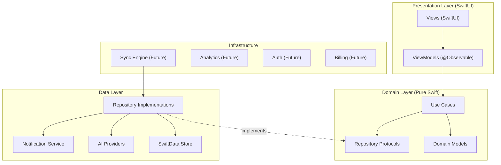

> [!NOTE]
> **Why @Observable over TCA?**
> 
> For a v1.0 that's local-first and single-user, Swift's native `@Observable` macro + Environment provides:
> - Zero third-party dependencies
> - Native SwiftUI integration
> - Simpler mental model
> - Better performance (no action/reducer overhead)
> - Easier onboarding for future contributors
> 
> TCA is excellent for complex multi-team apps but introduces ceremony that StackTask doesn't need yet. The Clean Architecture boundary means we can migrate to TCA later if needed — ViewModels are the seam.

## 5.2 Recommended Technology Stack

| Component | Technology | Rationale |
|-----------|-----------|-----------|
| **Language** | Swift 6 | Latest concurrency, strict safety |
| **UI Framework** | SwiftUI | Cross-platform, declarative, native feel |
| **Architecture** | Clean Architecture + MVVM | Separation of concerns, testable |
| **State Management** | `@Observable`, `@Environment` | Native, zero dependencies, performant |
| **Persistence** | SwiftData | Apple-native, CloudKit-ready, type-safe |
| **Networking** | Swift Concurrency + URLSession | No third-party needed |
| **AI Abstraction** | Custom protocol layer | Provider-agnostic |
| **Notifications** | UserNotifications | Native push + local |
| **Widgets** | WidgetKit + AppIntents | Interactive widgets, Live Activities |
| **Testing** | Swift Testing + XCTest | Modern test framework |
| **DI** | Environment + Protocols | Lightweight, SwiftUI-native |
| **NLP (v1)** | Rule-based parser | No API dependency, instant |
| **NLP (v2+)** | AI provider via abstraction | Pluggable, upgradeable |

## 5.3 Project Structure

```
StackTask/
├── StackTaskApp/                       # App entry points
│   ├── StackTaskApp.swift              # @main, scene configuration
│   ├── Assets.xcassets/               # App icons, colors, images
│   └── Info.plist
│
├── Core/                              # Pure Swift domain layer (no UI imports)
│   ├── Models/
│   │   ├── StackTask.swift            # Core task model
│   │   ├── RecurrenceRule.swift       # Recurrence patterns
│   │   ├── TaskFilter.swift           # Filter/sort definitions
│   │   └── TimelineSection.swift      # Day sections for timeline
│   ├── UseCases/
│   │   ├── CreateTaskUseCase.swift
│   │   ├── CompleteTaskUseCase.swift
│   │   ├── DeleteTaskUseCase.swift
│   │   ├── RescheduleTaskUseCase.swift
│   │   ├── RollOverdueTasksUseCase.swift
│   │   ├── SearchTasksUseCase.swift
│   │   └── ManageRecurringTasksUseCase.swift
│   ├── Repositories/
│   │   ├── TaskRepository.swift       # Protocol
│   │   └── SettingsRepository.swift   # Protocol
│   └── Services/
│       ├── AIService.swift            # Protocol
│       ├── NotificationService.swift  # Protocol
│       └── NLPParser.swift            # Protocol
│
├── Data/                              # Data layer implementations
│   ├── Persistence/
│   │   ├── SwiftDataTaskRepository.swift
│   │   ├── SwiftDataModels/
│   │   │   ├── PersistedTask.swift    # SwiftData @Model
│   │   │   └── PersistedSettings.swift
│   │   └── ModelContainer+Config.swift
│   ├── AI/
│   │   ├── AIProvider.swift           # Provider protocol
│   │   ├── OpenAIProvider.swift
│   │   ├── ClaudeProvider.swift
│   │   ├── GeminiProvider.swift
│   │   └── MockAIProvider.swift       # For testing/preview
│   ├── NLP/
│   │   ├── RuleBasedNLPParser.swift   # v1.0 parser
│   │   └── AINLPParser.swift          # v2.0 AI-backed parser
│   ├── Notifications/
│   │   └── LocalNotificationService.swift
│   └── Sync/                          # Future
│       └── CloudKitSyncEngine.swift
│
├── Presentation/                      # SwiftUI views + view models
│   ├── App/
│   │   ├── AppViewModel.swift         # Root state
│   │   └── AppCoordinator.swift       # Navigation
│   ├── Timeline/
│   │   ├── TimelineView.swift         # Main timeline
│   │   ├── TimelineViewModel.swift
│   │   ├── DayColumnView.swift        # Single day column
│   │   ├── TaskCardView.swift         # Task card component
│   │   ├── NowLineView.swift          # Moving "now" indicator
│   │   └── OverdueSectionView.swift   # Overdue grouping
│   ├── TaskCreation/
│   │   ├── QuickAddBarView.swift      # Bottom input bar
│   │   ├── QuickAddViewModel.swift
│   │   └── DateChipView.swift         # Today/Tmrw/Custom chips
│   ├── TaskEditing/
│   │   ├── TaskEditPopover.swift      # macOS popover
│   │   ├── TaskEditSheet.swift        # iOS sheet
│   │   └── TaskEditViewModel.swift
│   ├── CommandPalette/
│   │   ├── CommandPaletteView.swift   # ⌘K overlay
│   │   └── CommandPaletteViewModel.swift
│   ├── WeekView/
│   │   ├── WeekView.swift
│   │   └── WeekViewModel.swift
│   ├── MonthView/
│   │   ├── MonthView.swift
│   │   └── MonthViewModel.swift
│   ├── Search/
│   │   ├── SearchView.swift
│   │   └── SearchViewModel.swift
│   ├── AIChat/
│   │   ├── AIChatView.swift           # Side panel
│   │   └── AIChatViewModel.swift
│   ├── Settings/
│   │   ├── SettingsView.swift
│   │   └── SettingsViewModel.swift
│   ├── Components/                    # Shared UI components
│   │   ├── CheckboxView.swift
│   │   ├── UndoToastView.swift
│   │   ├── OverdueBadgeView.swift
│   │   ├── EmptyStateView.swift
│   │   └── LoadingView.swift
│   └── DesignSystem/
│       ├── STColors.swift
│       ├── STTypography.swift
│       ├── STSpacing.swift
│       ├── STAnimations.swift
│       └── STShadows.swift
│
├── Platform/                          # Platform-specific adaptations
│   ├── macOS/
│   │   ├── MacTimelineView.swift      # Horizontal timeline
│   │   ├── MacQuickAddBar.swift
│   │   ├── MacToolbar.swift
│   │   └── KeyboardShortcuts.swift
│   └── iOS/
│       ├── iOSTimelineView.swift      # Vertical day-card layout
│       ├── iOSQuickAddBar.swift
│       └── HapticFeedback.swift
│
├── Widgets/
│   ├── StackTaskWidget.swift          # Widget entry point
│   ├── SmallWidget.swift
│   ├── MediumWidget.swift
│   └── WidgetProvider.swift
│
├── Intents/                           # Shortcuts, Siri, Spotlight
│   ├── AddTaskIntent.swift
│   ├── CompleteTaskIntent.swift
│   └── SearchTasksIntent.swift
│
└── Tests/
    ├── CoreTests/
    │   ├── CreateTaskUseCaseTests.swift
    │   ├── RollOverdueTests.swift
    │   ├── RecurrenceTests.swift
    │   └── NLPParserTests.swift
    ├── DataTests/
    │   ├── SwiftDataRepositoryTests.swift
    │   └── AIProviderTests.swift
    └── PresentationTests/
        ├── TimelineViewModelTests.swift
        └── QuickAddViewModelTests.swift
```

## 5.4 Data Models

### Core Domain Model

```swift
// Core/Models/StackTask.swift

import Foundation

struct StackTask: Identifiable, Hashable, Sendable {
    let id: UUID
    var title: String
    var scheduledDate: Date           // The day this task appears on
    var startTime: Date?              // Optional exact start time
    var endTime: Date?                // Optional exact end time
    var isCompleted: Bool
    var completedAt: Date?
    var originalDate: Date            // Original creation/scheduled date (for overdue calc)
    var recurrenceRule: RecurrenceRule?
    var notes: String?
    var reminder: Date?
    var priority: Priority
    var tags: [String]
    var naturalLanguageRaw: String?   // Original NLP input
    var createdAt: Date
    var updatedAt: Date
    
    // Computed
    var overdueCount: Int {
        guard !isCompleted else { return 0 }
        let today = Calendar.current.startOfDay(for: .now)
        let original = Calendar.current.startOfDay(for: originalDate)
        return max(0, Calendar.current.dateComponents([.day], from: original, to: today).day ?? 0)
    }
    
    var isOverdue: Bool { overdueCount > 0 }
    var isTimed: Bool { startTime != nil }
    var isAnytime: Bool { startTime == nil }
    
    enum Priority: String, CaseIterable, Sendable {
        case none, low, medium, high
    }
}
```

### Recurrence Model

```swift
// Core/Models/RecurrenceRule.swift

struct RecurrenceRule: Hashable, Sendable {
    let frequency: Frequency
    let interval: Int                 // Every X days/weeks/months
    let daysOfWeek: Set<Weekday>?     // For weekly: which days
    let dayOfMonth: Int?              // For monthly: which day
    let endDate: Date?                // Optional end
    
    enum Frequency: String, Sendable {
        case daily, weekly, monthly, custom
    }
    
    enum Weekday: Int, CaseIterable, Sendable {
        case sunday = 1, monday, tuesday, wednesday, thursday, friday, saturday
    }
}
```

### SwiftData Persisted Model

```swift
// Data/Persistence/SwiftDataModels/PersistedTask.swift

import SwiftData

@Model
final class PersistedTask {
    @Attribute(.unique) var id: UUID
    var title: String
    var scheduledDate: Date
    var startTime: Date?
    var endTime: Date?
    var isCompleted: Bool
    var completedAt: Date?
    var originalDate: Date
    var recurrenceRuleData: Data?     // Codable RecurrenceRule
    var notes: String?
    var reminder: Date?
    var priorityRaw: String
    var tags: [String]
    var naturalLanguageRaw: String?
    var createdAt: Date
    var updatedAt: Date
    
    // Mapping to/from domain model
    func toDomain() -> StackTask { ... }
    static func from(_ task: StackTask) -> PersistedTask { ... }
}
```

> [!NOTE]
> **Why SwiftData over Core Data?**
> 
> 1. **Swift-native**: Type-safe, macro-based, no Objective-C runtime
> 2. **CloudKit integration**: Built-in sync when we add it later — just toggle `cloudKitContainerIdentifier`
> 3. **SwiftUI integration**: `@Query` macro works with `@Observable` seamlessly
> 4. **Migration support**: `VersionedSchema` for schema evolution
> 5. **Future-proof**: Apple's recommended path forward; Core Data is in maintenance mode
> 6. **Simpler**: No NSManagedObject, no NSFetchRequest, no NSPersistentContainer boilerplate

## 5.5 AI Abstraction Layer

```swift
// Core/Services/AIService.swift

protocol AIService: Sendable {
    func parseNaturalLanguage(_ input: String) async throws -> NLPResult
    func query(_ question: String, context: TaskContext) async throws -> AIResponse
    func suggestSchedule(for tasks: [StackTask]) async throws -> [ScheduleSuggestion]
}

struct NLPResult: Sendable {
    let title: String
    let date: Date?
    let startTime: Date?
    let endTime: Date?
    let recurrence: RecurrenceRule?
    let confidence: Double           // 0.0 - 1.0
}

struct TaskContext: Sendable {
    let allTasks: [StackTask]
    let overdueTasks: [StackTask]
    let todayTasks: [StackTask]
    let upcomingTasks: [StackTask]
}

enum AIResponse: Sendable {
    case text(String)
    case taskAction(TaskAction)
    case taskList([StackTask])
}

enum TaskAction: Sendable {
    case create(StackTask)
    case complete(UUID)
    case reschedule(UUID, to: Date)
    case delete(UUID)
    case batchReschedule([UUID], to: Date)
}
```

## 5.6 State Management

```swift
// Presentation/App/AppViewModel.swift

@Observable
final class AppViewModel {
    // View state
    var currentView: TimelineView = .threeDay
    var selectedDate: Date = .now
    var isCommandPaletteOpen = false
    var isAIChatOpen = false
    var searchQuery = ""
    
    // Undo stack
    var undoAction: UndoAction?
    
    // Dependencies (injected)
    private let taskRepository: TaskRepository
    private let aiService: AIService
    private let notificationService: NotificationService
    
    // Computed from repository
    var overdueTasks: [StackTask] { ... }
    var todayTasks: [StackTask] { ... }
    var timelineSections: [TimelineSection] { ... }
}
```

## 5.7 Dependency Injection

Using SwiftUI's `@Environment` for DI — no third-party container needed:

```swift
// Register dependencies
@main
struct StackTaskApp: App {
    let container = ModelContainer(for: PersistedTask.self)
    
    var body: some Scene {
        WindowGroup {
            ContentView()
                .environment(AppViewModel(
                    taskRepository: SwiftDataTaskRepository(container: container),
                    aiService: ConfiguredAIService(),
                    notificationService: LocalNotificationService()
                ))
        }
        .modelContainer(container)
    }
}
```

## 5.8 Testing Strategy

| Layer | Testing Approach | Tools |
|-------|-----------------|-------|
| **Domain (Use Cases)** | Unit tests with mock repositories | Swift Testing |
| **Data (Repositories)** | Integration tests with in-memory SwiftData | XCTest + in-memory ModelContainer |
| **AI Providers** | Unit tests with recorded responses | Swift Testing + MockAIProvider |
| **NLP Parser** | Parameterized tests with input/output pairs | Swift Testing |
| **ViewModels** | Unit tests with mock dependencies | Swift Testing |
| **Views** | Preview-based visual testing + UI tests | Xcode Previews + XCUITest |
| **Widgets** | Widget preview testing | WidgetKit previews |
| **E2E** | Critical user flow tests | XCUITest |

## 5.9 Future Server Architecture (Designed Now, Built Later)

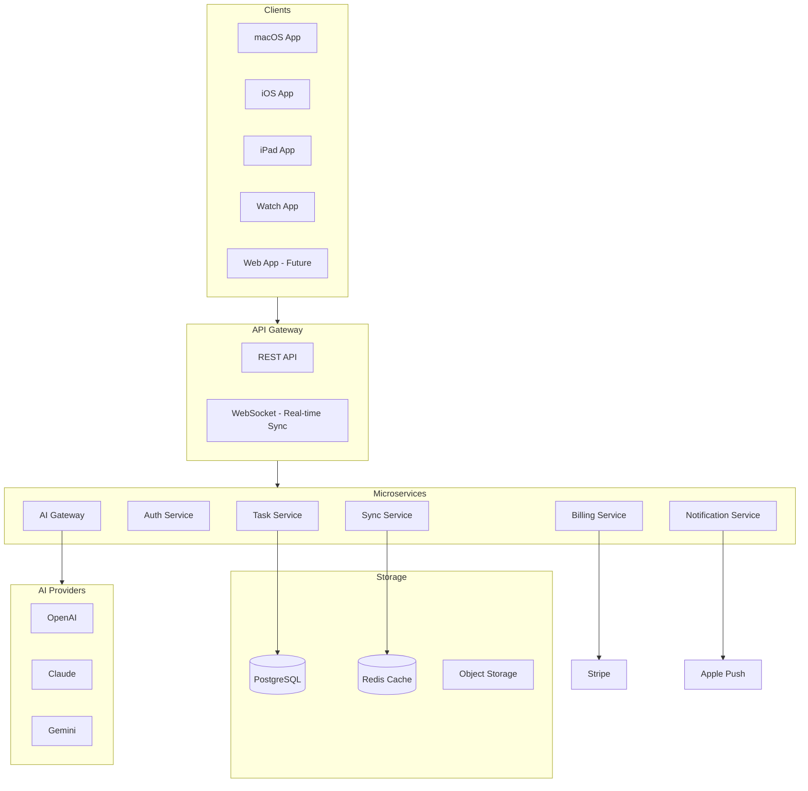

> [!IMPORTANT]
> This server architecture is designed now but NOT built for v1.0. The local-first architecture means the app works perfectly without any server. When we add sync, the `TaskRepository` protocol already abstracts storage — we just add a `CloudKitSyncEngine` or `APITaskRepository` implementation.

---

# 6. Animation Specification

## 6.1 Core Animation Principles

| Principle | Implementation |
|-----------|---------------|
| **Alive, not robotic** | Spring animations for everything interactive |
| **Subtle, not showy** | Short durations, gentle curves |
| **Purposeful** | Every animation communicates meaning |
| **Interruptible** | All animations can be interrupted by user action |
| **Respects Reduced Motion** | Falls back to opacity crossfade |

## 6.2 Animation Catalog

### Task Creation — "Squeeze In"

| Property | Value |
|----------|-------|
| **Type** | Spring |
| **Duration** | 0.4s |
| **Spring** | response: 0.5, dampingFraction: 0.7 |
| **Effect** | Card starts at scale(0.8, 0.8) + opacity(0), springs to scale(1, 1) + opacity(1). Neighboring cards shift to make room with matched spring. |
| **Reduced Motion** | Opacity fade 0→1, 0.2s ease |

### Task Completion — "Check & Slide"

| Property | Value |
|----------|-------|
| **Phase 1: Checkmark** | Duration: 0.3s, spring. Circle fills with accent color, checkmark draws with trim animation. |
| **Phase 2: Slide Away** | Duration: 0.4s, ease-out. Card slides right + fades. Remaining cards close gap with spring. |
| **Haptic (iOS)** | `.success` feedback |
| **Reduced Motion** | Opacity fade 1→0, 0.25s |

### Task Deletion — "Soft Pop"

| Property | Value |
|----------|-------|
| **Duration** | 0.3s |
| **Curve** | easeOut |
| **Effect** | Card scales to 0.95, opacity drops to 0, then collapses height to 0. Gap closes with spring animation. |
| **Haptic (iOS)** | `.light` feedback |
| **Reduced Motion** | Opacity fade, 0.2s |

### Now Line — "Continuous Flow"

| Property | Value |
|----------|-------|
| **Type** | Linear interpolation |
| **Update** | Every 60 seconds (or per-minute timer) |
| **Effect** | Vertical line position updates smoothly. Uses `withAnimation(.linear(duration: 60))` for continuous movement. |
| **Glow** | Subtle pulsing glow on the now line, `repeatForever`, 2s cycle |
| **Reduced Motion** | Static position, no glow pulse |

### Overdue Rollover — "Slide Forward"

| Property | Value |
|----------|-------|
| **Trigger** | App launch / midnight |
| **Duration** | 0.6s |
| **Curve** | Spring, response: 0.6, dampingFraction: 0.75 |
| **Effect** | Overdue tasks slide from previous day column into today's overdue section. Color transitions from blue to coral during slide. |
| **Stagger** | 0.08s between each task |
| **Reduced Motion** | Instant repositioning with opacity crossfade |

### Command Palette — "Drop In"

| Property | Value |
|----------|-------|
| **Open** | Scale from 0.95 + opacity 0 → 1.0 + opacity 1. Spring 0.35s. Backdrop blur animates in 0.2s. |
| **Close** | Reverse. 0.2s easeOut. |
| **List items** | Staggered fade-in, 0.03s apart |
| **Reduced Motion** | Opacity only, 0.2s |

### View Switch — "Morph"

| Property | Value |
|----------|-------|
| **Duration** | 0.4s |
| **Curve** | Spring, response: 0.45, dampingFraction: 0.85 |
| **Effect** | Task cards reposition with matched geometry effect. Day headers crossfade. Timeline scale adjusts smoothly. |
| **Reduced Motion** | Crossfade, 0.25s |

### Quick Add Bar Focus

| Property | Value |
|----------|-------|
| **Duration** | 0.25s |
| **Effect** | Bar subtly lifts (shadow deepens), border brightens, placeholder text fades to cursor |
| **Reduced Motion** | Border color change only |

### Undo Toast

| Property | Value |
|----------|-------|
| **Enter** | Slide up from bottom + spring. 0.35s. |
| **Exit** | Slide down + fade. 0.3s easeOut. |
| **Auto-dismiss** | After 5s with progress bar depleting |
| **Reduced Motion** | Opacity fade |

### Popover / Sheet

| Property | Value |
|----------|-------|
| **Open** | Spring from anchor point. Scale 0.9→1.0, opacity 0→1. 0.3s. |
| **Close** | Reverse to anchor. 0.2s easeOut. |
| **Reduced Motion** | Opacity only |

### Menu Items

| Property | Value |
|----------|-------|
| **Hover (macOS)** | Background color transition, 0.15s ease |
| **Press** | Scale 0.98, 0.1s. Spring back on release. |
| **Reduced Motion** | Instant state change |

---

# 7. Design System

## 7.1 Typography

Using **SF Pro** (system font) for native feel, with careful weight/size hierarchy:

| Role | Font | Size | Weight | Tracking |
|------|------|------|--------|----------|
| **Title Large** | SF Pro Rounded | 28pt | Semibold | -0.5 |
| **Title** | SF Pro Rounded | 22pt | Semibold | -0.3 |
| **Headline** | SF Pro Rounded | 17pt | Semibold | 0 |
| **Body** | SF Pro | 15pt | Regular | 0 |
| **Callout** | SF Pro | 14pt | Regular | 0 |
| **Caption** | SF Pro | 12pt | Regular | 0.2 |
| **Overdue Badge** | SF Pro | 11pt | Medium | 0.3 |
| **Day Header** | SF Pro Rounded | 16pt | Medium | 0.5 |
| **Task Title** | SF Pro | 15pt | Medium | 0 |
| **Timestamp** | SF Pro | 12pt | Regular | 0.2 |

> [!NOTE]
> **SF Pro Rounded** for headings gives StackTask its warm, approachable personality — similar to how Claude uses rounded, friendly typography. **SF Pro** (standard) for body text maintains readability.

## 7.2 Color System

### Light Mode

| Token | Hex | Usage |
|-------|-----|-------|
| **Background** | `#FAFAF8` | Main canvas — warm off-white, not sterile |
| **Surface** | `#FFFFFF` | Cards, popovers |
| **Surface Elevated** | `#FFFFFF` | Modals, command palette |
| **Text Primary** | `#1A1A1A` | Main text |
| **Text Secondary** | `#6B6B6B` | Captions, timestamps |
| **Text Tertiary** | `#9B9B9B` | Placeholders |
| **Accent** | `#3B82F6` | Active tasks, interactive elements |
| **Accent Hover** | `#2563EB` | Hover state |
| **Coral** | `#F4845F` | Overdue tasks — warm, not alarming |
| **Coral Light** | `#FEF0EC` | Overdue card background |
| **Success** | `#34D399` | Completion checkmark |
| **Now Line** | `#EF4444` | Current time indicator |
| **Now Line Glow** | `#EF444430` | Now line ambient glow |
| **Border** | `#E5E5E3` | Subtle card borders |
| **Border Focus** | `#3B82F6` | Focused input borders |
| **Shadow** | `#0000000A` | Card shadows |

### Dark Mode

| Token | Hex | Usage |
|-------|-----|-------|
| **Background** | `#1A1A1E` | Main canvas — warm dark, not pure black |
| **Surface** | `#242428` | Cards |
| **Surface Elevated** | `#2C2C30` | Modals, command palette |
| **Text Primary** | `#F5F5F3` | Main text |
| **Text Secondary** | `#9B9B9B` | Captions |
| **Text Tertiary** | `#6B6B6B` | Placeholders |
| **Accent** | `#60A5FA` | Active tasks — slightly lighter for dark bg |
| **Coral** | `#F4845F` | Same coral — works on dark |
| **Coral Light** | `#F4845F15` | Overdue card background |
| **Success** | `#34D399` | Completion |
| **Now Line** | `#EF4444` | Same red |
| **Border** | `#363638` | Card borders |
| **Shadow** | `#00000030` | Deeper shadows |

> [!TIP]
> The dark mode in your mockup uses a warm charcoal (`#1A1A1E`) rather than pure black (`#000000`). This is intentional — warm darks feel more inviting and are easier on the eyes. Pure black creates harsh contrast that feels clinical.

## 7.3 Spacing Scale

Based on a 4px grid:

| Token | Value | Usage |
|-------|-------|-------|
| `xs` | 4px | Tight spacing within components |
| `sm` | 8px | Component internal padding |
| `md` | 12px | Standard gap between elements |
| `lg` | 16px | Card padding, section spacing |
| `xl` | 24px | Section margins |
| `2xl` | 32px | Major section separation |
| `3xl` | 48px | Page margins |

## 7.4 Corner Radius

| Element | Radius | Notes |
|---------|--------|-------|
| Task Card | 12px | Generous, friendly |
| Button | 8px | Standard |
| Input Field | 10px | Slightly larger than buttons |
| Popover | 14px | Generous |
| Command Palette | 16px | Premium feel |
| Checkbox | Full circle | — |
| Tag Chip | 6px | Compact |
| Toast | 12px | Matches cards |

## 7.5 Shadows

| Element | Shadow | Notes |
|---------|--------|-------|
| Task Card (resting) | `0 1px 3px rgba(0,0,0,0.04)` | Barely visible, just enough lift |
| Task Card (hover) | `0 4px 12px rgba(0,0,0,0.08)` | Subtle lift on interaction |
| Popover | `0 8px 32px rgba(0,0,0,0.12)` | Elevated floating |
| Command Palette | `0 16px 64px rgba(0,0,0,0.16)` | Strong presence |
| Quick Add Bar | `0 -2px 12px rgba(0,0,0,0.06)` | Upward shadow (docked to bottom) |
| Undo Toast | `0 4px 16px rgba(0,0,0,0.10)` | Floating |

## 7.6 Icons

Use **SF Symbols** exclusively for:
- Native consistency
- Dynamic weight matching with text
- Accessibility support built-in
- No additional dependencies

Key icons:

| Usage | SF Symbol |
|-------|-----------|
| Add task | `plus.circle` |
| Complete | `circle` → `checkmark.circle.fill` |
| Delete | `trash` |
| Calendar | `calendar` |
| Clock | `clock` |
| Recurrence | `repeat` |
| Notification | `bell` |
| Search | `magnifyingglass` |
| Settings | `gearshape` |
| AI | `sparkles` |
| Command | `command` |
| Overdue | `exclamationmark.triangle` |
| Menu | `ellipsis.circle` |
| Today | `sun.max` |

## 7.7 Task Card Variants

### Active Task (Blue)

```
┌──────────────────────────┐ ← 12px radius, accent bg
│  ○  Task Title           │ ← 15pt medium, white text
│     10:00 AM - 2:00 PM   │ ← 12pt regular, white/80%
└──────────────────────────┘
   ↑ 1px border accent/20%
   Shadow: card resting
```

### Overdue Task (Coral)

```
     2 days ago              ← 11pt medium, coral, outside card
┌──────────────────────────┐ ← 12px radius, coral bg
│  ○  Task Title           │ ← 15pt medium, white text
└──────────────────────────┘
   Shadow: card resting
```

### Anytime Task (Active)

```
     Today Anytime           ← 11pt medium, text secondary
┌──────────────────────────┐ ← 12px radius, accent bg
│  ○  Task Title           │ ← 15pt medium, white text  
└──────────────────────────┘
```

### Completed Task

```
┌──────────────────────────┐ ← 12px radius, surface bg, opacity 60%
│  ✓  ̶T̶a̶s̶k̶ ̶T̶i̶t̶l̶e̶           │ ← 15pt medium, strikethrough, text tertiary
└──────────────────────────┘
```

## 7.8 Selection & Interaction States

| State | Visual Change |
|-------|--------------|
| **Hover (macOS)** | Card lifts slightly (shadow increases), subtle brightness |
| **Pressed** | Card scales to 0.98 |
| **Selected** | Accent border ring, 2px |
| **Drag** | Card lifts with larger shadow, 0.6 opacity ghost in original position |
| **Focus (keyboard)** | Accent outline ring, 2px offset |
| **Disabled** | 40% opacity, no interaction |

## 7.9 Now Line

```
     ┃  ← 2px width
     ┃  ← Color: Now Line (#EF4444)
     ┃  ← Glow: 8px blur, Now Line Glow color
     ●  ← 8px circle at top of line
     ┃  ← Full height of timeline area
     ┃
```

---

# 8. Feature Roadmap

## Version 1.0 — Foundation (MVP)

**Goal:** A beautiful, fast task manager that nails the core experience.

| Feature | Priority | Notes |
|---------|----------|-------|
| Horizontal timeline (macOS) | P0 | The defining feature |
| Vertical day-card timeline (iPhone) | P0 | Mobile-native adaptation |
| 3-Day default view | P0 | Primary view |
| Task CRUD (create, read, update, delete) | P0 | Core |
| Anytime + Timed tasks | P0 | Both types |
| Overdue auto-rollover | P0 | Defining behavior |
| Quick Add bar | P0 | Speed is everything |
| Completion animation | P0 | Delight |
| Undo toast | P0 | Safety |
| Command Palette (⌘K) macOS | P0 | Power user essential |
| Dark/Light/System themes | P0 | Expected |
| Keyboard shortcuts (macOS) | P0 | Expected for native app |
| Rule-based NLP parsing (basic) | P1 | "Buy groceries tomorrow" |
| NLP clarification fallback | P1 | When parser isn't confident |
| Week view | P1 | Important alternate view |
| Month view | P1 | Planning view |
| Recurring tasks (daily/weekly/monthly) | P1 | Common need |
| Task reminders (local notifications) | P1 | Expected |
| Settings screen | P1 | Necessary |
| SwiftData persistence | P0 | Data storage |
| Inline task editing | P1 | Edit without friction |
| Search (local, instant) | P1 | Find tasks fast |
| VoiceOver / Accessibility | P1 | Not optional |
| Reduced Motion support | P1 | Not optional |

## Version 1.5 — Polish & Expand

| Feature | Notes |
|---------|-------|
| iPad support | Adaptive layout |
| Widgets (Home Screen, Lock Screen, Desktop) | WidgetKit |
| Interactive widgets | AppIntents |
| Morning summary notification | Configurable |
| Evening review notification | Configurable |
| Subtasks | One level deep |
| Task tags / filtering | Lightweight categorization |
| Drag-to-reschedule (macOS) | Drag task card between days |
| Custom recurrence patterns | Every 3 days, etc. |
| Spotlight integration | Search tasks from Spotlight |
| Siri Shortcuts | "Add task: buy milk" |
| Live Activities (iPhone) | Current task on Dynamic Island |
| AI chat panel (side panel) | Conversational task management |
| AI provider selection in Settings | OpenAI / Claude / Gemini |
| Calendar integration (read Apple Calendar) | Show calendar events on timeline |
| Handoff between Mac and iPhone | Continuity |
| Data export | JSON / CSV |

## Version 2.0 — Intelligence & Scale

| Feature | Notes |
|---------|-------|
| Apple Watch app | Complication + glance |
| AI-powered NLP (replaces rule-based) | Better natural language understanding |
| Smart scheduling suggestions | "You have free time at 2pm" |
| Workload analysis & summarization | "You completed 15 tasks this week" |
| Task decomposition | AI breaks large tasks into subtasks |
| iCloud sync | Multi-device via CloudKit |
| Calendar write integration | Create calendar events from tasks |
| Task history / analytics | Personal productivity insights |
| Focus mode integration | Show relevant tasks during Focus |
| Semantic search (AI-powered) | "Tasks about health" |
| Priority suggestions | AI recommends what to do first |
| Keyboard shortcut customization | User-defined shortcuts |

## Future SaaS Version

| Feature | Notes |
|---------|-------|
| User accounts (email, Apple Sign-In) | Authentication |
| Cloud sync (custom backend) | PostgreSQL + WebSockets |
| Shared calendars | Collaborative task management |
| Team workspaces | Organization-level |
| Subscription billing | RevenueCat / Stripe |
| Web app | Browser-based access |
| API for integrations | Third-party apps |
| Zapier / Shortcuts automation | Workflow integration |
| Enterprise SSO | SAML, OIDC |
| Admin dashboard | Usage analytics, team management |
| White-label option | Custom branding |

---

# 9. Risk Assessment

## 9.1 Technical Risks

| Risk | Severity | Mitigation |
|------|----------|------------|
| **SwiftData maturity** | Medium | SwiftData is stable in 2026 but has occasional edge cases with complex queries. Mitigation: Keep queries simple, write integration tests, abstract behind repository protocol so we can swap implementations. |
| **Horizontal timeline performance** | Medium | Rendering many task cards in a horizontal scroll with real-time now-line movement could cause frame drops. Mitigation: Lazy loading, limit visible cards, use Canvas for now-line, profile early. |
| **NLP parser accuracy** | Medium | Rule-based parsing will handle common patterns but fail on edge cases. Mitigation: The clarification fallback handles uncertainty gracefully. AI-based parsing in v1.5 will improve accuracy. |
| **CloudKit sync conflicts** | Low (future) | When adding sync, concurrent edits from multiple devices can conflict. Mitigation: Design with last-writer-wins for simple fields, merge for collections, conflict resolution UI for title changes. |
| **Large task counts (500+)** | Low | Performance with many tasks over time. Mitigation: Archive completed tasks older than 30 days, lazy loading, predicate-based fetching. |

## 9.2 UX Risks

| Risk | Severity | Mitigation |
|------|----------|------------|
| **Overdue pile-up causing avoidance** | High | If a user falls behind, 20+ overdue tasks could be overwhelming. Mitigation: Collapsible overdue section, "Still relevant?" cleanup prompt after 7 days, bulk actions ("complete all" / "reschedule all"). |
| **Timeline concept not intuitive** | Medium | Horizontal timelines are uncommon in task apps. Users may not immediately understand the metaphor. Mitigation: Subtle onboarding animation on first launch showing time flowing, "now" line moving. Keep the bottom quick-add bar familiar (similar to Reminders). |
| **Mobile layout compromise** | Medium | Converting the horizontal timeline to vertical loses some of the app's personality. Mitigation: iPhone gets a carefully designed vertical layout that preserves the *feeling* of time flow through visual cues (time labels, overdue stacking, "now" divider). |
| **Quick add bar confusion with AI/search** | Low | Multi-purpose input bars can confuse users about what will happen when they type. Mitigation: Clear visual indicator of mode. Default is always "create task". Explicit prefix or button for AI/search. |

## 9.3 Product Risks

| Risk | Severity | Mitigation |
|------|----------|------------|
| **Feature creep** | High | The temptation to add "just one more thing" before v1.0. Mitigation: This roadmap is the contract. v1.0 ships only P0+P1 features. Everything else is v1.5+. |
| **Subscription fatigue** | Medium (future) | Users may resist another subscription. Mitigation: Generous free tier, premium features must be genuinely valuable (AI, sync), consider one-time purchase option. |
| **App Store approval** | Low | AI features may require review. Mitigation: AI is optional, works without API keys, rule-based parser is the default. |

## 9.4 Open Questions for You

> [!NOTE]
> ### Resolved Design Decisions
>
> 1. **App Name**: StackTask ✅
> 2. **iPhone Layout**: Vertical day-card layout with peek previews ✅
> 3. **3-Day Scope**: Today + Next 2 Days (forward-looking) ✅
> 4. **Priority**: Included in v1.0 (none/low/medium/high, optional) ✅
> 5. **Tags**: Included in v1.0 ✅
> 6. **Brain dump**: Always lands on Today — no separate Inbox ✅
> 7. **Calendar Events**: Optional Apple Calendar integration via Settings (read-only) ✅
> 8. **Notes**: Plain text in v1.0, rich text in v2.0 ✅
> 9. **Accent Colors**: Customizable palette in Settings ✅

---

# 10. Implementation Plan

## Milestone Overview

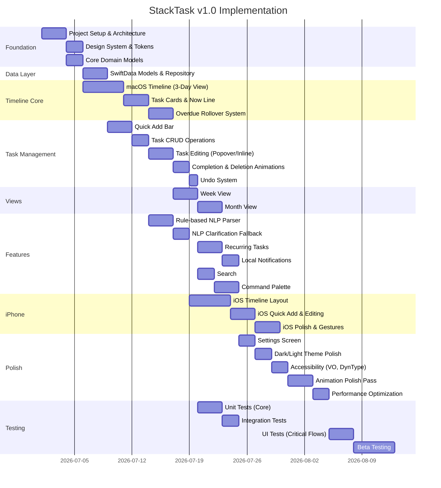

## Milestone Details

### Milestone 1: Project Setup & Architecture (3 days)

- Create Xcode project with multi-platform target (macOS + iOS)
- Configure project structure per Section 5.3
- Set up Swift Package structure for Core / Data / Presentation separation
- Configure SwiftData ModelContainer
- Set up basic dependency injection
- Create placeholder entry points for both platforms
- **Deliverable:** Project builds and runs on both macOS and iOS with empty screens

### Milestone 2: Design System & Tokens (2 days)

- Implement `STColors`, `STTypography`, `STSpacing`, `STAnimations`, `STShadows`
- Create SwiftUI view modifiers for consistent styling
- Set up color assets for light/dark mode
- Create component library stubs
- **Deliverable:** Design tokens applied to a test view on both platforms

### Milestone 3: Core Domain Models (2 days)

- Implement `StackTask`, `RecurrenceRule`, `TaskFilter`, `TimelineSection`
- Define repository protocols (`TaskRepository`, `SettingsRepository`)
- Implement use cases (`CreateTaskUseCase`, `CompleteTaskUseCase`, etc.)
- Write unit tests for core models
- **Deliverable:** All domain logic tested in isolation

### Milestone 4: SwiftData Models & Repository (3 days)

- Implement `PersistedTask` SwiftData model
- Implement `SwiftDataTaskRepository` conforming to `TaskRepository`
- Domain ↔ Persistence mapping
- Integration tests with in-memory ModelContainer
- **Deliverable:** Tasks can be created, read, updated, deleted via repository

### Milestone 5: macOS Timeline — 3-Day View (5 days)

- `TimelineView` with horizontal scrolling 3-day layout
- `DayColumnView` with day headers, time grid
- Overdue section, Timed section, Anytime section per day
- `NowLineView` with real-time position updates
- Smooth horizontal scrolling with day snapping
- **Deliverable:** Functional 3-day timeline displaying mock tasks

### Milestone 6: Task Cards & Now Line (3 days)

- `TaskCardView` with all variants (active, overdue, timed, anytime, completed)
- Checkbox component with tap interaction
- Now line with continuous movement and glow
- Card hover/press states (macOS)
- **Deliverable:** Cards display correctly in all states, now line moves

### Milestone 7: Overdue Rollover System (3 days)

- Background task for midnight rollover
- App-launch rollover check
- `RollOverdueTasksUseCase` with date arithmetic
- Overdue count computation and badge display
- Coral color treatment for overdue cards
- Rollover animation (slide from previous day)
- **Deliverable:** Overdue tasks automatically roll forward with correct display

### Milestone 8: Quick Add Bar (3 days)

- `QuickAddBarView` docked to bottom
- Text input with placeholder "What Needs Doing..."
- Date chip buttons (Today, Tmrw, Custom Date)
- Three-dot menu with time picker popover
- Enter to save, Escape to cancel
- `⌘N` keyboard shortcut to focus
- **Deliverable:** Users can create tasks in < 3 seconds

### Milestone 9: Task CRUD Operations (2 days)

- Create: Quick Add → repository → timeline updates
- Read: Real-time query from SwiftData
- Update: Modify task properties → auto-save
- Delete: Remove from repository with animation
- Wire up ViewModel ↔ Repository ↔ SwiftData
- **Deliverable:** Full CRUD working end-to-end

### Milestone 10: Task Editing (3 days)

- macOS: Single-click popover (`TaskEditPopover`)
- macOS: Double-click inline title edit
- macOS: Right-click context menu
- Auto-save on popover dismiss
- Date picker, time picker, recurrence selector in popover
- **Deliverable:** All edit interactions working on macOS

### Milestone 11: Completion & Deletion Animations (2 days)

- Checkmark draw animation
- Slide-away completion animation
- Soft pop deletion animation
- Gap-closing spring animation
- Haptic feedback definitions (for iOS)
- **Deliverable:** All animations polished and feeling great

### Milestone 12: Undo System (1 day)

- `UndoToastView` component
- 5-second undo window
- Undo for completion and deletion
- Toast stacking for rapid actions
- **Deliverable:** Undo works reliably for destructive actions

### Milestone 13-14: Week & Month Views (6 days)

- Week view: 7-day column layout with task counts
- Month view: Calendar grid with dot indicators
- Day detail expansion in month view
- View switching with morph animation
- **Deliverable:** All three views working and animated

### Milestone 15-16: NLP Parser (5 days)

- Rule-based parser for common patterns
- Date extraction ("tomorrow", "Friday", "next week")
- Time extraction ("at 3", "3pm", "10am-2pm")
- Recurrence detection ("every Monday", "daily")
- Confidence scoring
- Clarification fallback UI for low-confidence parses
- **Deliverable:** Natural language input creates correct tasks

### Milestone 17-18: Recurring Tasks & Notifications (5 days)

- RecurrenceRule implementation (daily/weekly/monthly)
- Next occurrence calculation on completion
- Recurring task editing ("just this one" / "all future")
- Local notification scheduling for reminders
- Morning summary and evening review notifications
- **Deliverable:** Recurring tasks and notifications working

### Milestone 19-20: Search & Command Palette (5 days)

- Instant local search across titles, notes, dates
- Search results highlighting
- Command Palette overlay (macOS)
- Fuzzy matching for commands and tasks
- Keyboard navigation within palette
- **Deliverable:** Search and ⌘K fully functional

### Milestone 21-23: iPhone App (11 days)

- Vertical day-card timeline layout
- Swipe navigation between days
- Bottom quick-add bar (adapted for iOS)
- Long-press context menus
- Swipe actions (complete, reschedule)
- iOS-specific haptics
- Task edit half-sheet
- Segmented control for view switching
- Performance optimization for iOS
- **Deliverable:** Complete iPhone experience, native-feeling

### Milestone 24-26: Settings, Themes, Accessibility (6 days)

- Settings screen (both platforms)
- Dark/Light/System theme with smooth transitions
- VoiceOver labels on all interactive elements
- Dynamic Type support
- Reduced Motion fallbacks
- High Contrast support
- Keyboard navigation (macOS) for all views
- **Deliverable:** Fully accessible, themed app

### Milestone 27-28: Polish & Performance (5 days)

- Full animation review pass
- 60fps profiling and optimization
- Memory usage audit
- Launch time optimization
- Edge case handling (empty states, error states)
- Empty state illustrations
- **Deliverable:** Buttery smooth experience

### Milestone 29-31: Testing (8 days)

- Unit tests: Core use cases, NLP parser, models
- Integration tests: Repository, data flow
- UI tests: Task creation, completion, deletion, overdue rollover, view switching
- Performance tests: Scroll performance, memory
- **Deliverable:** Comprehensive test suite

### Milestone 32: Beta Testing (5 days)

- TestFlight deployment
- Dogfooding on personal devices
- Bug fixes from real-world usage
- Final polish adjustments
- **Deliverable:** Release candidate

---

## Summary

| Metric | Value |
|--------|-------|
| **Total Milestones** | 32 |
| **Estimated Total Duration** | ~13-16 weeks |
| **Core Dependencies** | Zero third-party (pure Apple stack) |
| **Platforms (v1.0)** | macOS + iPhone |
| **Key Differentiator** | Moving timeline + automatic overdue rollover |
| **Architecture** | Clean Architecture, ready for sync/AI/subscriptions |
